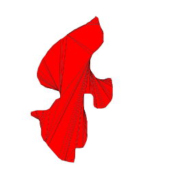
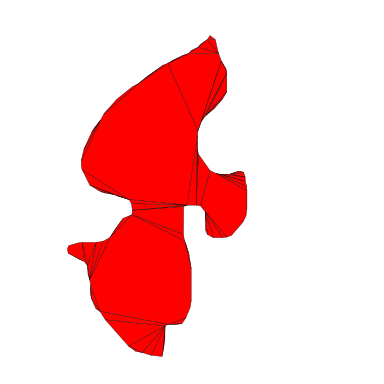
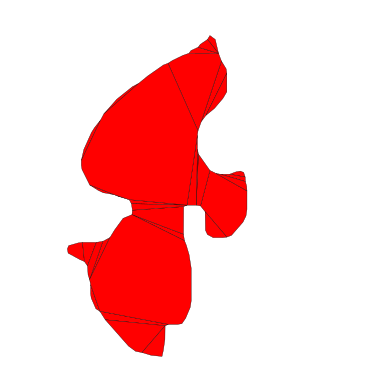

# Fast Polygon Decomposition for Large Polygons

[Mark Keil's algorithm for decomposing a polygon](https://mpen.ca/406/keil) into convex polygons is elegant because of its simplicity:
```python
diags = decomp(poly)
	min, tmp : EdgeList
	ndiags : Integer
	for each reflex vertex i
		for every other vertex j
			if i can see j
				left = the polygon given by vertices i to j
				right = the polygon given by vertices j to i
				tmp = decomp(left) + decomp(right)
				if(tmp.size < ndiags)
					min = tmp
					ndiags = tmp.size
					min += the diagonal i to j
	return min
```
But for large polygons this is very slow.
So let's skip the optimality and just take the first possible decomposition: 
```python
diags = decomp(poly)
	for each reflex vertex i
		for every other vertex j
			if i can see j
				left = the polygon given by vertices i to j
				right = the polygon given by vertices j to i
				return decomp(left) + decomp(right)			
	return poly
```



This version is not optimal, but it is much faster. However, the subpolygons do not correspond to the natural subregions of the original polygon. Therefore, let's first visit the closest neighbors of our reflection points:

```python
diags = decomp(poly)
	for each reflex vertex i
		for every other vertex j sorted by distance to i 
			if i can see j
				left = the polygon given by vertices i to j
				right = the polygon given by vertices j to i
				return decomp(left) + decomp(right)			
	return poly
```

The result looks more natural. Some adjacent polygons can still be joined to form larger, still convex polygons:

This gives us a quick and easy decomposition that is good enough for most applications.
